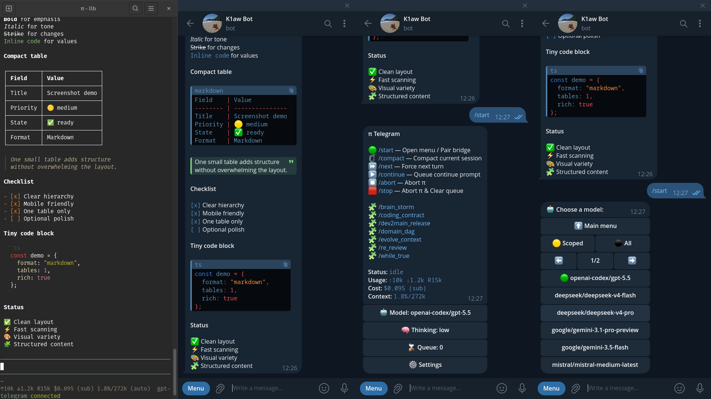

# pi-telegram



> Full pi build session: [View the session transcript](https://pi.dev/session/#14acfe07b7844c8abec55ed9fbddc17f), which captures the full pi session in which `pi-telegram` was built.

Telegram DM bridge for pi, with **rich message streaming** (live thinking, tool calls, and Markdown rendering via Telegram's Bot API rich-message methods).

## Install

From git:

```bash
pi install git:github.com/hiasinho/pi-telegram
```

Or for a single run:

```bash
pi -e git:github.com/hiasinho/pi-telegram
```

## Configure

### Telegram

1. Open [@BotFather](https://t.me/BotFather)
2. Run `/newbot`
3. Pick a name and username
4. Copy the bot token

### pi

Start pi, then run:

```bash
/telegram-setup
```

Paste the bot token when prompted.

The extension stores config in:

```text
~/.pi/agent/telegram.json
```

## Connect a pi session

The Telegram bridge is session-local. Connect it only in the pi session that should own the bot:

```bash
/telegram-connect
```

To stop polling in the current session:

```bash
/telegram-disconnect
```

Check status:

```bash
/telegram-status
```

## Pair your Telegram account

After token setup and `/telegram-connect`:

1. Open the DM with your bot in Telegram
2. Send `/start`

The first DM user becomes the allowed Telegram user for the bridge. The extension only accepts messages from that user.

## Usage

Chat with your bot in Telegram DMs.

### Send text

Send any message in the bot DM. It is forwarded into pi with a `[telegram]` prefix.

### Send images and files

Send images, albums, or files in the DM.

The extension:
- downloads them to `~/.pi/agent/tmp/telegram`
- includes local file paths in the prompt
- forwards inbound images as image inputs to pi

### Ask for files back

If you ask pi for a file or generated artifact, pi should call the `telegram_attach` tool. The extension then sends those files with the next Telegram reply.

Examples:
- `summarize this image`
- `read this README and summarize it`
- `write me a markdown file with the plan and send it back`
- `generate a shell script and attach it`

### Commands

The bridge registers its Telegram command menu when the bot token is configured. It always registers:

```text
/status
/compact
/new
/reload
/model
/think
/stop
```

If the `pi-boomerang` extension is loaded, it also registers:

```text
/boom
/boom_cancel
```

`/status` shows the current model, thinking level, usage, cost, and context usage.

`/stop` or `stop` aborts the active pi turn.

`/compact` compacts the current session. It is only accepted while pi is idle.

`/new` starts a fresh pi session, and `/reload` reloads configuration, resources, and extensions. Both commands require pi to be running interactively inside tmux, because the bridge sends the command to Pi's tmux pane. They are only accepted while pi is idle; send `stop` first if a turn is running.

`/think` shows the current thinking level. `/think high` changes it. Supported levels are `off`, `minimal`, `low`, `medium`, `high`, and `xhigh`. Pi may clamp the requested level if the current model supports fewer levels.

`/model` shows the current model and the session's scoped model list. `/model next`, `/model prev`, `/model provider/model-id`, or `/model model-id` switches within that scoped list. Switching is disabled when the Pi session has no scoped models configured, and model changes are only accepted while pi is idle. The reply includes the effective thinking level after Pi clamps it for the new model.

`/boom <task>` maps to Pi's `/boomerang <task>` command, and `/boom_cancel` maps to Pi's `/boomerang-cancel` command. Telegram also accepts `/boomerang` and `/boomerang_cancel` as hidden aliases. When boomerang completes, the hidden `boomerang-handoff` summary is forwarded to Telegram, followed by Pi's normal post-boomerang response.

### Queue follow-ups

If you send more Telegram messages while pi is busy, they are queued and processed in order.

## Streaming

The bridge streams the assistant response back to Telegram **live** while pi is generating, using Telegram's rich-message Bot API methods. The stream is driven by a small phase state machine per assistant segment:

```
thinking  →  tools  →  answering  →  done
```

- **`thinking`** — shows a static `Working…` block in a `<tg-thinking>` bubble while the model reasons. (The raw reasoning trace is *not* sent — only a static placeholder — because dumping the full trace reads badly in the client.)
- **`tools`** — tool calls are shown live in a fenced `bash` code block, one tool per line, e.g.
  ```text
  bash: ls -la
  read: src/index.ts
  edit: index.ts
  ```
- **`answering`** — the answer streams in (Markdown rendered natively by Telegram), and the thinking block drops out.
- **`done`** — the finished segment is persisted with `sendRichMessage`.

### Rich Markdown replies

Final (and streamed) replies are sent as **Telegram Rich Markdown** — GitHub-Flavored Markdown plus a few HTML tags. Headings, **bold**, *italic*, `code`, fenced code blocks, lists, tables, block quotes, spoilers, footnotes, `$LaTeX$`, links, and media all render natively in the Telegram client.

The extension ships a **skill**, `telegram-rich-markdown`, documenting the full supported syntax. It is registered automatically and appears at startup so the model can reference it when composing replies. See `skills/telegram-rich-markdown/SKILL.md`.

### Pure rich flow

The bridge uses **only** the rich-message API surface:

- `sendRichMessageDraft` — streams partial content (the live preview)
- `sendRichMessage` — persists the finalized message (up to 32768 chars; longer output is auto-chunked)

There is no `sendMessage` / `editMessageText` / `sendMessageDraft` fallback path. Rich messages are the only output channel, so replies render with full formatting.

> **Note:** Rich-message methods (`sendRichMessage`, `sendRichMessageDraft`) and the `<tg-thinking>` block are recent Bot API additions. They require a current Telegram Bot API server and a client that renders bot message drafts. The `<tg-thinking>` tag is **draft-only** and is stripped from the persisted final message (the API rejects it in `sendRichMessage`).

## Notes

- Only one pi session should be connected to the bot at a time
- Replies are sent as normal Telegram messages, not quote-replies
- Long replies are split below Telegram's 32768-character rich-message limit
- Outbound files are sent via `telegram_attach`
- The first user to message the bot is locked in as the allowed user; all others are rejected

## License

MIT
